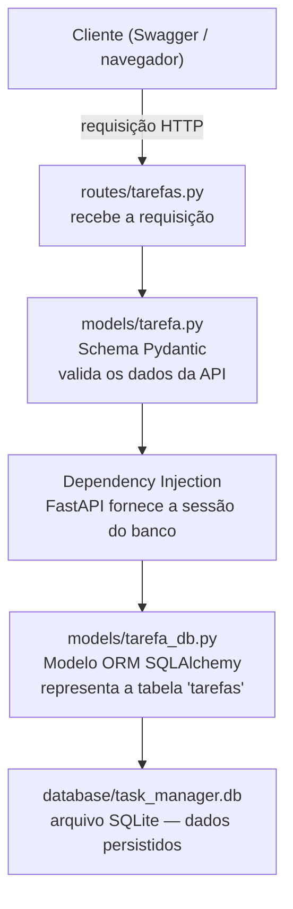
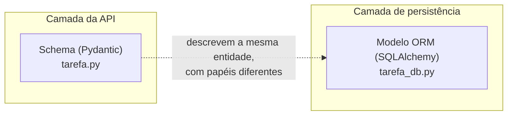

# Arquitetura — Task Manager (Back-end)

Este documento dá uma visão geral de como o back-end do projeto está organizado:
as camadas, os arquivos que compõem cada uma, e como uma requisição percorre o
sistema até o banco de dados.

> Este documento cobre apenas o **back-end**, único componente implementado até
> o momento. Quando o front-end for iniciado, este arquivo será expandido com a
> camada de interface e sua integração com a API.

---

## Visão geral

O projeto segue uma **Arquitetura em Camadas**: cada pasta dentro de `app/` tem
uma responsabilidade técnica única, e dentro de cada camada os arquivos são
organizados por **domínio** (assunto). Hoje existe um único domínio — Tarefas —
mas a estrutura já está preparada para crescer (ex: um futuro domínio de
Usuários teria seu próprio arquivo em cada camada).

| Camada | Pasta | Responsabilidade |
|---|---|---|
| Routes | `app/routes/` | Recebe as requisições HTTP — o "porteiro" da API |
| Schema | `app/models/tarefa.py` | Valida o formato dos dados que entram/saem pela API |
| Modelo ORM | `app/models/tarefa_db.py` | Representa a tabela real no banco de dados |
| Persistência | `database/` | Configuração de conexão e o arquivo do banco SQLite |

---

## Estrutura de pastas

```
task_manager/
├── app/
│   ├── __init__.py
│   ├── routes/
│   │   ├── __init__.py
│   │   └── tarefas.py          # GET e POST de tarefas
│   ├── services/
│   │   └── __init__.py         # regras de negócio (ainda vazio)
│   └── models/
│       ├── __init__.py
│       ├── tarefa.py           # Schema Pydantic (contrato da API)
│       └── tarefa_db.py        # Modelo ORM SQLAlchemy (tabela real)
├── database/
│   ├── __init__.py
│   ├── db.py                   # Engine, Session, Base (SQLAlchemy)
│   └── task_manager.db         # arquivo do banco SQLite
├── tests/
│   └── __init__.py
├── venv/                       # ambiente virtual (fora do controle de versão)
├── main.py                     # ponto de entrada da aplicação
├── start.sh                    # script que sobe a API
├── requirements.txt            # dependências com versões travadas
├── README.md
├── GUIDE.md                    # diário técnico, sessão por sessão
└── ARCHITECTURE.md             # este documento
```

---

## Fluxo de uma requisição

O diagrama abaixo mostra o caminho planejado de uma requisição, da chegada
pelo cliente até a gravação no banco de dados.



> **Status atual:** os passos A, B e C já estão implementados e em uso. Os
> passos D, E e F (linha pontilhada conceitual) já têm a estrutura criada
> (Engine, Session, modelo ORM, tabela no banco), mas a *conexão* das rotas a
> essa estrutura — via Dependency Injection — é a próxima etapa do projeto.
> Hoje, na prática, as rotas ainda usam uma lista Python em memória como
> armazenamento temporário.

---

## Schema vs Modelo ORM

Um ponto central da arquitetura é a separação entre dois modelos que descrevem
a mesma entidade (Tarefa), cada um com uma finalidade diferente:



| Aspecto | Schema (Pydantic) | Modelo ORM (SQLAlchemy) |
|---|---|---|
| Arquivo | `app/models/tarefa.py` | `app/models/tarefa_db.py` |
| Papel | Valida dados de entrada/saída da API | Representa a tabela real no banco |
| Quando existe | Apenas durante uma requisição | Sempre — é a estrutura persistida |
| Tipos de campo | Enum (`StatusTarefa`, `PrioridadeTarefa`) | String simples |
| Analogia | Planta arquitetônica de uma casa | Fundação e estrutura da casa |

Os dois modelos não derivam um do outro — são representações independentes da
mesma entidade do mundo real, cada uma otimizada para sua finalidade.

---

## Stack do back-end

| Tecnologia | Papel no projeto |
|---|---|
| FastAPI | Framework da API — rotas, validação automática, documentação OpenAPI/Swagger |
| Pydantic | Validação de schemas (já incluso no FastAPI) |
| SQLAlchemy | ORM — traduz classes Python em tabelas e operações SQL |
| SQLite | Banco de dados relacional, armazenado em arquivo único |
| Uvicorn | Servidor ASGI que executa a aplicação FastAPI |
| Pytest | Framework de testes automatizados (cobertura ainda não iniciada) |
| DB Browser for SQLite | Ferramenta visual para inspecionar o banco fora do código |

---

## Decisões de arquitetura registradas

- **Camada por tipo técnico, domínio dentro da camada** — optou-se por
  `routes/`, `services/`, `models/` como divisão primária, com um arquivo por
  domínio dentro de cada uma, em vez de uma pasta completa por domínio
  (alternativa comum em outros ecossistemas, como NestJS ou Spring).
- **Separação entre Schema e Modelo ORM** — mesmo havendo sobreposição de
  campos, os dois modelos são mantidos como arquivos distintos para preservar
  responsabilidades únicas e permitir que evoluam de forma independente.
- **SQLite como banco inicial** — escolhido por não exigir instalação de
  servidor separado, adequado à fase atual de aprendizado e prototipagem.
  Pode ser substituído por outro banco relacional no futuro sem reescrever a
  camada de rotas, graças ao uso do ORM.

---

## Documentos relacionados

- [`README.md`](./README.md) — instruções de instalação e uso
- [`GUIDE.md`](./GUIDE.md) — diário técnico, registrado sessão por sessão, com
  o histórico de decisões, problemas encontrados e soluções aplicadas
