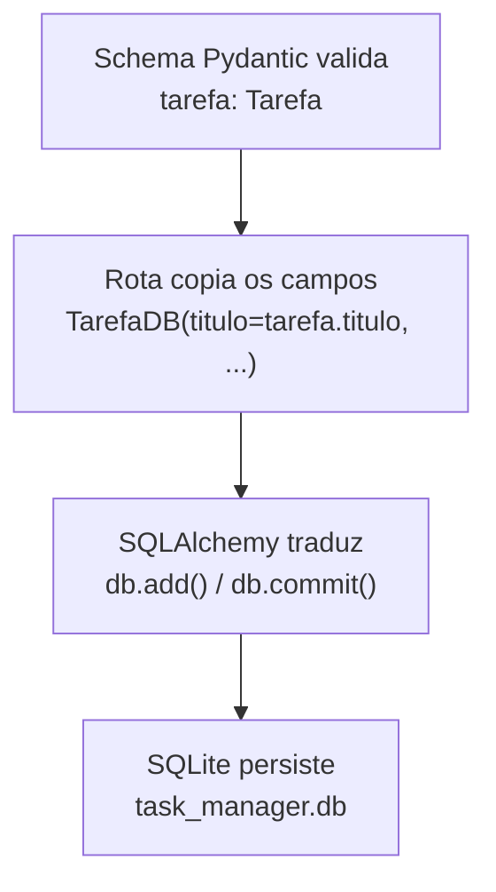

# GUIDE — Diário Técnico do Projeto Task Manager

Este arquivo registra as atividades desenvolvidas em cada sessão do projeto,
servindo como material de referência e estudo.

**Padrão de cabeçalho:** toda sessão registra **Data** e **Branch** logo no
início, mesmo quando coincide com a sessão anterior — facilita rastrear
quando cada decisão foi tomada.

---

## Sessão 1 — Setup do Ambiente
**Data:** 15/06/2025
**Branch:** feature/setup_do_projeto

### Resumo

| Atividade | Status |
|---|---|
| Mapeamento do ambiente | ✅ |
| Definição e escolha de versões | ✅ |
| Criação do ambiente virtual | ✅ |
| Instalação das dependências | ✅ |
| Geração do requirements.txt | ✅ |
| Estrutura de pastas criada | ✅ |
| Arquivos __init__.py criados | ✅ |
| .gitignore configurado | ✅ |
| Primeiro commit e push | ✅ |

---

## Sessão 2 — Primeira Rota da API (Tarefas)
**Data:** 19/06/2026
**Branch:** feature/backend

Modelagem da entidade Tarefa, criação do schema Pydantic (`app/models/tarefa.py`)
e das rotas GET/POST (`app/routes/tarefas.py`), conectadas ao `main.py`.
Armazenamento temporário em lista Python (`tarefas_db = []`), sem persistência real.

**Problemas resolvidos:** erro de import no VS Code (interpretador errado),
`event not found` no Bash (`!` dentro de aspas duplas), rota duplicada por
prefixo repetido, rotas não aparecendo por falta de `include_router`, e erro de
sintaxe no Enum (`status: StatusTarefa.pendente` sem o `=`).

### Resumo

| Atividade | Status |
|---|---|
| Modelagem da entidade Tarefa | ✅ |
| Criação do schema Pydantic | ✅ |
| Criação das rotas GET e POST | ✅ |
| Conexão das rotas ao main.py | ✅ |
| Testes manuais via Swagger | ✅ |

---

## Sessão 3 — Conexão com SQLite via SQLAlchemy
**Data:** 20/06/2026
**Branch:** feature/backend

---

### 3.1 Conceito-chave: Schema vs Modelo ORM

Antes de codar, estabelecemos a diferença entre dois modelos que representam
a mesma entidade (Tarefa), mas com papéis distintos:

| Modelo | Onde vive | Papel | Biblioteca | Quando existe |
|---|---|---|---|---|
| **Schema** | `app/models/tarefa.py` | Define o formato dos dados da **API** | Pydantic | Só durante a requisição |
| **Modelo ORM** | `app/models/tarefa_db.py` | Define a **tabela real** no banco | SQLAlchemy | Sempre — é a tabela persistida |

**Analogia usada:** o schema é como a planta arquitetônica de uma casa (mostra
o layout para quem visita); o modelo ORM é a fundação e estrutura real (existe
independente de haver visita ou não). Mudar a "pintura" (schema) não exige
reforçar a "fundação" (tabela), e vice-versa.

---

### 3.2 Instalação do SQLAlchemy

```bash
pip install sqlalchemy==2.0.36
pip freeze > requirements.txt
```

> A instalação trouxe a dependência `greenlet` automaticamente — usada
> internamente pelo SQLAlchemy para suportar operações assíncronas.

**Regra reforçada:** sempre que uma dependência é instalada ou removida, repetir
`pip freeze > requirements.txt` para manter o arquivo fiel ao ambiente real.

---

### 3.3 Configuração da Conexão (Engine, Session, Base)

```python
# database/db.py
from sqlalchemy import create_engine
from sqlalchemy.orm import sessionmaker, declarative_base

DATABASE_URL = "sqlite:///./database/task_manager.db"

engine = create_engine(DATABASE_URL, connect_args={"check_same_thread": False})

SessionLocal = sessionmaker(autocommit=False, autoflush=False, bind=engine)

Base = declarative_base()
```

Validação:
```bash
python -c 'from database.db import engine, SessionLocal, Base; print("Conexão configurada com sucesso!")'
```

---

### 3.4 Criação do Modelo ORM

```python
# app/models/tarefa_db.py
from sqlalchemy import Column, Integer, String, DateTime, Date

from database.db import Base


class TarefaDB(Base):
    __tablename__ = "tarefas"

    id = Column(Integer, primary_key=True, index=True)
    titulo = Column(String, nullable=False)
    descricao = Column(String, nullable=True)
    status = Column(String, default="pendente", nullable=False)
    prioridade = Column(String, default="media", nullable=False)
    data_criacao = Column(DateTime, nullable=False)
    data_vencimento = Column(Date, nullable=True)
```

Validação:
```bash
python -c 'from app.models.tarefa_db import TarefaDB; print("Modelo ORM carregado com sucesso!")'
```

---

### 3.5 Criação da Tabela no Banco

```bash
python -c 'from database.db import Base, engine; from app.models.tarefa_db import TarefaDB; Base.metadata.create_all(bind=engine); print("Tabela criada com sucesso!")'
```

Resultado: arquivo `database/task_manager.db` criado, com a tabela `tarefas`
e o índice `ix_tarefas_id` (gerado por `index=True`).

---

### 3.6 Inspeção Visual com DB Browser for SQLite

Instalado a partir de https://sqlitebrowser.org/dl/ (versão 3.13.0, win64).

**Regra importante estabelecida:** criar uma tabela manualmente pela interface
do DB Browser não basta — o SQLAlchemy só reconhece tabelas que tenham um
modelo ORM correspondente declarado em Python. A interface serve para
inspecionar e rascunhar visualmente, mas a criação "oficial" continua vindo
do código.

---

### 3.7 Script de Automação — start.sh

```bash
# start.sh
#!/bin/bash
echo "Ativando ambiente virtual..."
source venv/Scripts/activate

echo "Subindo a API..."
uvicorn main:app --reload
```

```bash
chmod +x start.sh
./start.sh
```

---

### Resumo da Sessão 3

| Atividade | Status |
|---|---|
| Conceito Schema vs Modelo ORM esclarecido | ✅ |
| Instalação do SQLAlchemy (versão travada) | ✅ |
| Configuração de Engine, Session, Base | ✅ |
| Criação do modelo ORM TarefaDB | ✅ |
| Criação da tabela no SQLite | ✅ |
| Instalação e uso do DB Browser for SQLite | ✅ |
| Criação do script start.sh | ✅ |
| Conexão das rotas ao banco real (Dependency Injection) | ⏳ adiado para Sessão 4 |

---

## Sessão 4 — Dependency Injection, DELETE, PUT e Black Formatter
**Data:** 23/06/2026
**Branch:** feature/backend

---

### 4.1 Dependency Injection — Conectando as Rotas ao Banco Real

Adicionada a `database/db.py`:

```python
def get_db():
    db = SessionLocal()
    try:
        yield db
    finally:
        db.close()
```

`app/routes/tarefas.py` reescrito para usar o banco real em vez da lista em
memória, com `GET` e `POST` usando `db: Session = Depends(get_db)`.

**Testado e confirmado de duas formas independentes:**
- Via Swagger: POST retornou `id: 1` gerado pelo banco.
- Via DB Browser, aba "Execute SQL", `select * from tarefas` — mesma linha
  confirmada na tabela física.

> Esse é o marco em que o fluxo planejado no fim da Sessão 3 se tornou real:
> Cliente → Schema (Pydantic) → Dependency Injection → Modelo ORM → SQLite.

---

### 4.2 DELETE — Remoção por ID

```python
@router.delete("/{tarefa_id}")
def deletar_tarefa(tarefa_id: int, db: Session = Depends(get_db)):
    tarefa = db.query(TarefaDB).filter(TarefaDB.id == tarefa_id).first()

    if tarefa is None:
        raise HTTPException(status_code=404, detail="Tarefa não encontrada")

    db.delete(tarefa)
    db.commit()
    return {"detail": "Tarefa removida com sucesso"}
```

**Erros cometidos e corrigidos durante a escrita manual:**
- `@router.delete("/tarefa_id}")` — faltava o `{` de abertura do path parameter.
- `@router.delete("{/tarefa.id}")` — chave na posição errada e `.id` em vez de `_id`.
- `TarefaDB.id == tarefa.id` em vez de `TarefaDB.id == tarefa_id` — confundir a
  variável que vem da URL (`tarefa_id`, um número) com o atributo de um objeto
  que ainda não existe naquela linha (`tarefa.id`).

**Testado:** sequência completa — listar, criar, deletar um id existente
(sucesso), tentar deletar um id inexistente (404 retornado corretamente).

---

### 4.3 PUT — Atualização Completa

```python
@router.put("/{tarefa_id}")
def alterar_tarefa(tarefa_id: int, tarefa_atualizada: Tarefa, db: Session = Depends(get_db)):
    tarefa = db.query(TarefaDB).filter(TarefaDB.id == tarefa_id).first()

    if tarefa is None:
        raise HTTPException(status_code=404, detail="Tarefa não encontrada")

    tarefa.titulo = tarefa_atualizada.titulo
    tarefa.descricao = tarefa_atualizada.descricao
    tarefa.status = tarefa_atualizada.status
    tarefa.prioridade = tarefa_atualizada.prioridade
    tarefa.data_vencimento = tarefa_atualizada.data_vencimento

    db.commit()
    db.refresh(tarefa)
    return tarefa
```

Note que **`data_criacao` não é atualizada** — a data de criação original da
tarefa não deve mudar por uma edição posterior.

**Erros cometidos e corrigidos:**
- Tentativa inicial reaproveitou a lógica do POST (criar `nova_tarefa` com
  `TarefaDB(...)` e `db.add()`) em vez de atualizar o objeto já buscado.
- Atribuições inválidas como `status = tarefa.status = concluida` (dois `=` na
  mesma linha, valor sem aspas/Enum).
- Indentação inconsistente, que quebrou a sintaxe do arquivo inteiro e
  impediu até o Black de formatar.
- Função inicialmente sem o parâmetro `tarefa_atualizada: Tarefa`, causando
  `"tarefa_atualizada" is not defined`.

**Testado:** reteste com valores diferentes do padrão confirmou a atualização.
Erro de validação ao enviar `"concluída"` (com acento) — comportamento correto
do Pydantic, que só aceita os valores exatos do Enum (`pendente`,
`em_andamento`, `concluida`).

---

### 4.4 Black Formatter — Padronização Automática de Código

**Versão instalada:** Black 26.5.1 (estilo estável 2026).

```bash
pip install black==26.5.1
pip freeze > requirements.txt
```

**Configuração no VS Code** (`settings.json` do usuário, fora do repositório):
```json
"[python]": {
    "editor.defaultFormatter": "ms-python.black-formatter",
    "editor.formatOnSave": true
}
```

**Problema encontrado:** o autoformat não acontecia ao salvar. Diagnóstico
pela aba "Problems" revelou que a causa não era configuração, e sim um erro
de sintaxe no próprio arquivo (a indentação inconsistente do PUT, item 4.3).

> **Lição registrada:** se o Black "não fizer nada" ao salvar, o primeiro
> suspeito é um erro de sintaxe no arquivo, não a configuração da extensão.

---

### 4.5 Fluxo Completo — Pydantic, Rota e SQLAlchemy

Pydantic e SQLAlchemy **não se comunicam diretamente**. A ponte entre os dois
é o código da rota, escrito por nós, que copia campo a campo.



---

### Resumo da Sessão 4

| Atividade | Status |
|---|---|
| Dependency Injection implementada (GET e POST usando o banco real) | ✅ |
| Rota DELETE com validação 404 | ✅ |
| Rota PUT com atualização completa | ✅ |
| Black Formatter instalado e configurado | ✅ |
| Fluxo Pydantic → Rota → SQLAlchemy → SQLite esclarecido | ✅ |
| Commit e push da sessão | ✅ |

---

## Cronograma — Fechamento do Back-end

**Definido em:** 22/06/2026
**Carga:** 2h/dia, todos os dias da semana (incluindo fins de semana)

| Dia | Data | Foco | Status |
|---|---|---|---|
| 1 | Ter, 23/06 | Dependency Injection | ✅ concluído (Sessão 4) |
| 2 | Qua, 24/06 | CRUD — PUT e DELETE | ✅ concluído (Sessão 4, antecipado) |
| 3 | Qui, 25/06 | CRUD — PATCH | ⏳ pendente |
| 4 | Sex, 26/06 | Camada de Services | ⏳ pendente |
| 5 | Sáb, 27/06 | Introdução ao Pytest | ⏳ pendente |
| 6 | Dom, 28/06 | Testes do CRUD | ⏳ pendente |
| 7 | Seg, 29/06 | Revisão e fechamento | ⏳ pendente |

> Os Dias 1 e 2 foram concluídos na mesma sessão (23/06), adiantando o
> cronograma original.
