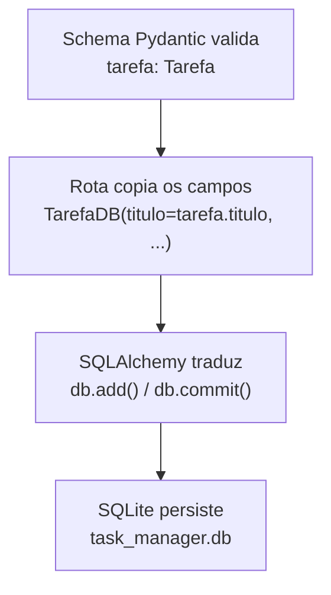

# GUIDE — Diário Técnico do Projeto Task Manager

Este arquivo registra as atividades desenvolvidas em cada sessão do projeto,
servindo como material de referência e estudo.

**Padrão de cabeçalho:** toda sessão registra **Data** e **Branch** logo no
início, mesmo quando coincide com a sessão anterior — facilita rastrear
quando cada decisão foi tomada.

---

## Sessão 1 — Setup do Ambiente
**Data:** 15/06/2025
**Branch:** feature/setup_do_projeto

### Resumo

| Atividade | Status |
|---|---|
| Mapeamento do ambiente | ✅ |
| Definição e escolha de versões | ✅ |
| Criação do ambiente virtual | ✅ |
| Instalação das dependências | ✅ |
| Geração do requirements.txt | ✅ |
| Estrutura de pastas criada | ✅ |
| Arquivos __init__.py criados | ✅ |
| .gitignore configurado | ✅ |
| Primeiro commit e push | ✅ |

---

## Sessão 2 — Primeira Rota da API (Tarefas)
**Data:** 19/06/2026
**Branch:** feature/backend

Modelagem da entidade Tarefa, criação do schema Pydantic (`app/models/tarefa.py`)
e das rotas GET/POST (`app/routes/tarefas.py`), conectadas ao `main.py`.
Armazenamento temporário em lista Python (`tarefas_db = []`), sem persistência real.

**Problemas resolvidos:** erro de import no VS Code (interpretador errado),
`event not found` no Bash (`!` dentro de aspas duplas), rota duplicada por
prefixo repetido, rotas não aparecendo por falta de `include_router`, e erro de
sintaxe no Enum (`status: StatusTarefa.pendente` sem o `=`).

### Resumo

| Atividade | Status |
|---|---|
| Modelagem da entidade Tarefa | ✅ |
| Criação do schema Pydantic | ✅ |
| Criação das rotas GET e POST | ✅ |
| Conexão das rotas ao main.py | ✅ |
| Testes manuais via Swagger | ✅ |

---

## Sessão 3 — Conexão com SQLite via SQLAlchemy
**Data:** 20/06/2026
**Branch:** feature/backend

---

### 3.1 Conceito-chave: Schema vs Modelo ORM

Antes de codar, estabelecemos a diferença entre dois modelos que representam
a mesma entidade (Tarefa), mas com papéis distintos:

| Modelo | Onde vive | Papel | Biblioteca | Quando existe |
|---|---|---|---|---|
| **Schema** | `app/models/tarefa.py` | Define o formato dos dados da **API** | Pydantic | Só durante a requisição |
| **Modelo ORM** | `app/models/tarefa_db.py` | Define a **tabela real** no banco | SQLAlchemy | Sempre — é a tabela persistida |

**Analogia usada:** o schema é como a planta arquitetônica de uma casa (mostra
o layout para quem visita); o modelo ORM é a fundação e estrutura real (existe
independente de haver visita ou não). Mudar a "pintura" (schema) não exige
reforçar a "fundação" (tabela), e vice-versa.

---

### 3.2 Instalação do SQLAlchemy

```bash
pip install sqlalchemy==2.0.36
pip freeze > requirements.txt
```

> A instalação trouxe a dependência `greenlet` automaticamente — usada
> internamente pelo SQLAlchemy para suportar operações assíncronas.

**Regra reforçada:** sempre que uma dependência é instalada ou removida, repetir
`pip freeze > requirements.txt` para manter o arquivo fiel ao ambiente real.

---

### 3.3 Configuração da Conexão (Engine, Session, Base)

```python
# database/db.py
from sqlalchemy import create_engine
from sqlalchemy.orm import sessionmaker, declarative_base

DATABASE_URL = "sqlite:///./database/task_manager.db"

engine = create_engine(DATABASE_URL, connect_args={"check_same_thread": False})

SessionLocal = sessionmaker(autocommit=False, autoflush=False, bind=engine)

Base = declarative_base()
```

Validação:
```bash
python -c 'from database.db import engine, SessionLocal, Base; print("Conexão configurada com sucesso!")'
```

---

### 3.4 Criação do Modelo ORM

```python
# app/models/tarefa_db.py
from sqlalchemy import Column, Integer, String, DateTime, Date

from database.db import Base


class TarefaDB(Base):
    __tablename__ = "tarefas"

    id = Column(Integer, primary_key=True, index=True)
    titulo = Column(String, nullable=False)
    descricao = Column(String, nullable=True)
    status = Column(String, default="pendente", nullable=False)
    prioridade = Column(String, default="media", nullable=False)
    data_criacao = Column(DateTime, nullable=False)
    data_vencimento = Column(Date, nullable=True)
```

Validação:
```bash
python -c 'from app.models.tarefa_db import TarefaDB; print("Modelo ORM carregado com sucesso!")'
```

---

### 3.5 Criação da Tabela no Banco

```bash
python -c 'from database.db import Base, engine; from app.models.tarefa_db import TarefaDB; Base.metadata.create_all(bind=engine); print("Tabela criada com sucesso!")'
```

Resultado: arquivo `database/task_manager.db` criado, com a tabela `tarefas`
e o índice `ix_tarefas_id` (gerado por `index=True`).

---

### 3.6 Inspeção Visual com DB Browser for SQLite

Instalado a partir de https://sqlitebrowser.org/dl/ (versão 3.13.0, win64).

**Regra importante estabelecida:** criar uma tabela manualmente pela interface
do DB Browser não basta — o SQLAlchemy só reconhece tabelas que tenham um
modelo ORM correspondente declarado em Python. A interface serve para
inspecionar e rascunhar visualmente, mas a criação "oficial" continua vindo
do código.

---

### 3.7 Script de Automação — start.sh

```bash
# start.sh
#!/bin/bash
echo "Ativando ambiente virtual..."
source venv/Scripts/activate

echo "Subindo a API..."
uvicorn main:app --reload
```

```bash
chmod +x start.sh
./start.sh
```

---

### Resumo da Sessão 3

| Atividade | Status |
|---|---|
| Conceito Schema vs Modelo ORM esclarecido | ✅ |
| Instalação do SQLAlchemy (versão travada) | ✅ |
| Configuração de Engine, Session, Base | ✅ |
| Criação do modelo ORM TarefaDB | ✅ |
| Criação da tabela no SQLite | ✅ |
| Instalação e uso do DB Browser for SQLite | ✅ |
| Criação do script start.sh | ✅ |
| Conexão das rotas ao banco real (Dependency Injection) | ⏳ adiado para Sessão 4 |

---

## Sessão 4 — Dependency Injection, DELETE, PUT e Black Formatter
**Data:** 23/06/2026
**Branch:** feature/backend

---

### 4.1 Dependency Injection — Conectando as Rotas ao Banco Real

Adicionada a `database/db.py`:

```python
def get_db():
    db = SessionLocal()
    try:
        yield db
    finally:
        db.close()
```

`app/routes/tarefas.py` reescrito para usar o banco real em vez da lista em
memória, com `GET` e `POST` usando `db: Session = Depends(get_db)`.

**Testado e confirmado de duas formas independentes:**
- Via Swagger: POST retornou `id: 1` gerado pelo banco.
- Via DB Browser, aba "Execute SQL", `select * from tarefas` — mesma linha
  confirmada na tabela física.

> Esse é o marco em que o fluxo planejado no fim da Sessão 3 se tornou real:
> Cliente → Schema (Pydantic) → Dependency Injection → Modelo ORM → SQLite.

---

### 4.2 DELETE — Remoção por ID

```python
@router.delete("/{tarefa_id}")
def deletar_tarefa(tarefa_id: int, db: Session = Depends(get_db)):
    tarefa = db.query(TarefaDB).filter(TarefaDB.id == tarefa_id).first()

    if tarefa is None:
        raise HTTPException(status_code=404, detail="Tarefa não encontrada")

    db.delete(tarefa)
    db.commit()
    return {"detail": "Tarefa removida com sucesso"}
```

**Erros cometidos e corrigidos durante a escrita manual:**
- `@router.delete("/tarefa_id}")` — faltava o `{` de abertura do path parameter.
- `@router.delete("{/tarefa.id}")` — chave na posição errada e `.id` em vez de `_id`.
- `TarefaDB.id == tarefa.id` em vez de `TarefaDB.id == tarefa_id` — confundir a
  variável que vem da URL (`tarefa_id`, um número) com o atributo de um objeto
  que ainda não existe naquela linha (`tarefa.id`).

**Testado:** sequência completa — listar, criar, deletar um id existente
(sucesso), tentar deletar um id inexistente (404 retornado corretamente).

---

### 4.3 PUT — Atualização Completa

```python
@router.put("/{tarefa_id}")
def alterar_tarefa(tarefa_id: int, tarefa_atualizada: Tarefa, db: Session = Depends(get_db)):
    tarefa = db.query(TarefaDB).filter(TarefaDB.id == tarefa_id).first()

    if tarefa is None:
        raise HTTPException(status_code=404, detail="Tarefa não encontrada")

    tarefa.titulo = tarefa_atualizada.titulo
    tarefa.descricao = tarefa_atualizada.descricao
    tarefa.status = tarefa_atualizada.status
    tarefa.prioridade = tarefa_atualizada.prioridade
    tarefa.data_vencimento = tarefa_atualizada.data_vencimento

    db.commit()
    db.refresh(tarefa)
    return tarefa
```

Note que **`data_criacao` não é atualizada** — a data de criação original da
tarefa não deve mudar por uma edição posterior.

**Erros cometidos e corrigidos:**
- Tentativa inicial reaproveitou a lógica do POST (criar `nova_tarefa` com
  `TarefaDB(...)` e `db.add()`) em vez de atualizar o objeto já buscado.
- Atribuições inválidas como `status = tarefa.status = concluida` (dois `=` na
  mesma linha, valor sem aspas/Enum).
- Indentação inconsistente, que quebrou a sintaxe do arquivo inteiro e
  impediu até o Black de formatar.
- Função inicialmente sem o parâmetro `tarefa_atualizada: Tarefa`, causando
  `"tarefa_atualizada" is not defined`.

**Testado:** reteste com valores diferentes do padrão confirmou a atualização.
Erro de validação ao enviar `"concluída"` (com acento) — comportamento correto
do Pydantic, que só aceita os valores exatos do Enum (`pendente`,
`em_andamento`, `concluida`).

---

### 4.4 Black Formatter — Padronização Automática de Código

**Versão instalada:** Black 26.5.1 (estilo estável 2026).

```bash
pip install black==26.5.1
pip freeze > requirements.txt
```

**Configuração no VS Code** (`settings.json` do usuário, fora do repositório):
```json
"[python]": {
    "editor.defaultFormatter": "ms-python.black-formatter",
    "editor.formatOnSave": true
}
```

**Problema encontrado:** o autoformat não acontecia ao salvar. Diagnóstico
pela aba "Problems" revelou que a causa não era configuração, e sim um erro
de sintaxe no próprio arquivo (a indentação inconsistente do PUT, item 4.3).

> **Lição registrada:** se o Black "não fizer nada" ao salvar, o primeiro
> suspeito é um erro de sintaxe no arquivo, não a configuração da extensão.

---

### 4.5 Fluxo Completo — Pydantic, Rota e SQLAlchemy

Pydantic e SQLAlchemy **não se comunicam diretamente**. A ponte entre os dois
é o código da rota, escrito por nós, que copia campo a campo.



---

### Resumo da Sessão 4

| Atividade | Status |
|---|---|
| Dependency Injection implementada (GET e POST usando o banco real) | ✅ |
| Rota DELETE com validação 404 | ✅ |
| Rota PUT com atualização completa | ✅ |
| Black Formatter instalado e configurado | ✅ |
| Fluxo Pydantic → Rota → SQLAlchemy → SQLite esclarecido | ✅ |
| Commit e push da sessão | ✅ |

---


## Sessão 5 — Camada de Services e Validação Cruzada (Swagger + Postman)
**Data:** 24/06/2026
**Branch:** feature/backend

---

### 5.1 Por que extrair a lógica para Services

Até a Sessão 4, as rotas em `app/routes/tarefas.py` faziam duas coisas ao
mesmo tempo: recebiam a requisição HTTP **e** sabiam como buscar/criar/
atualizar no banco. Isso mistura duas responsabilidades diferentes no mesmo
lugar.

**Motivação prática (não só teórica):** se no futuro existir outra forma de
criar uma tarefa (ex: um script de linha de comando, sem passar pela API), a
lógica de negócio precisaria ser duplicada se estivesse só dentro da rota.
Com a lógica em `services/`, tanto a rota quanto outro consumidor poderiam
chamar a mesma função.

**Divisão de responsabilidade após a refatoração:**

| Camada | Antes | Depois |
|---|---|---|
| Rota | Recebe requisição + busca no banco + valida + salva | Só recebe a requisição e chama o service |
| Service | *(não existia)* | Busca no banco + valida + salva |

**Convenção de nomes adotada** (inglês no service, português na rota — separa
a "língua do HTTP" da "língua do negócio"):

| Operação | Nome na Rota | Nome no Service |
|---|---|---|
| Listar | `listar_tarefas` | `get_tarefas` |
| Criar | `criar_tarefa` | `create_tarefa` |
| Deletar | `deletar_tarefa` | `delete_tarefa` |
| Atualizar (PUT) | `alterar_tarefa` | `update_tarefa` |
| Atualizar parcial (PATCH) | `atualizar_parcial` | `patch_tarefa` |

**Organização do arquivo:** seguindo a mesma lógica já usada em routes/models
(camada técnica primeiro, domínio dentro da camada), todos os services do
domínio Tarefa ficam em um único arquivo: `app/services/tarefa_service.py`.

---

### 5.2 Implementação

```python
# app/services/tarefa_service.py
from datetime import datetime

from fastapi import HTTPException
from sqlalchemy.orm import Session

from app.models.tarefa import Tarefa, TarefaPatch
from app.models.tarefa_db import TarefaDB


def get_tarefas(db: Session):
    return db.query(TarefaDB).all()


def create_tarefa(tarefa: Tarefa, db: Session):
    nova_tarefa = TarefaDB(
        titulo=tarefa.titulo,
        descricao=tarefa.descricao,
        status=tarefa.status,
        prioridade=tarefa.prioridade,
        data_criacao=datetime.now(),
        data_vencimento=tarefa.data_vencimento,
    )
    db.add(nova_tarefa)
    db.commit()
    db.refresh(nova_tarefa)
    return nova_tarefa


def delete_tarefa(tarefa_id: int, db: Session):
    tarefa = db.query(TarefaDB).filter(TarefaDB.id == tarefa_id).first()

    if tarefa is None:
        raise HTTPException(status_code=404, detail="Tarefa não encontrada")

    db.delete(tarefa)
    db.commit()
    return {"detail": "Tarefa removida com sucesso"}


def update_tarefa(tarefa_id: int, tarefa_atualizada: Tarefa, db: Session):
    tarefa = db.query(TarefaDB).filter(TarefaDB.id == tarefa_id).first()

    if tarefa is None:
        raise HTTPException(status_code=404, detail="Tarefa não encontrada")

    tarefa.titulo = tarefa_atualizada.titulo
    tarefa.descricao = tarefa_atualizada.descricao
    tarefa.status = tarefa_atualizada.status
    tarefa.prioridade = tarefa_atualizada.prioridade
    tarefa.data_vencimento = tarefa_atualizada.data_vencimento

    db.commit()
    db.refresh(tarefa)
    return tarefa


def patch_tarefa(tarefa_id: int, dados: TarefaPatch, db: Session):
    tarefa = db.query(TarefaDB).filter(TarefaDB.id == tarefa_id).first()

    if tarefa is None:
        raise HTTPException(status_code=404, detail="Tarefa não encontrada")

    dados_enviados = dados.model_dump(exclude_unset=True)

    for campo, valor in dados_enviados.items():
        setattr(tarefa, campo, valor)

    db.commit()
    db.refresh(tarefa)
    return tarefa
```

`app/routes/tarefas.py` reduzido a apenas orquestrar — decorator, parâmetros
da rota (incluindo `Depends(get_db)`) e uma chamada ao service correspondente:

```python
from fastapi import APIRouter, Depends
from sqlalchemy.orm import Session

from app.models.tarefa import Tarefa, TarefaPatch
from app.services import tarefa_service
from database.db import get_db

router = APIRouter(prefix="/v1/tarefas", tags=["tarefas"])


@router.get("/")
def listar_tarefas(db: Session = Depends(get_db)):
    return tarefa_service.get_tarefas(db)


@router.post("/")
def criar_tarefa(tarefa: Tarefa, db: Session = Depends(get_db)):
    return tarefa_service.create_tarefa(tarefa, db)


@router.delete("/{tarefa_id}")
def deletar_tarefa(tarefa_id: int, db: Session = Depends(get_db)):
    return tarefa_service.delete_tarefa(tarefa_id, db)


@router.put("/{tarefa_id}")
def alterar_tarefa(tarefa_id: int, tarefa_atualizada: Tarefa, db: Session = Depends(get_db)):
    return tarefa_service.update_tarefa(tarefa_id, tarefa_atualizada, db)


@router.patch("/{tarefa_id}")
def atualizar_parcial(tarefa_id: int, dados: TarefaPatch, db: Session = Depends(get_db)):
    return tarefa_service.patch_tarefa(tarefa_id, dados, db)
```

Imports não mais utilizados na rota (`datetime`, `TarefaDB`) removidos após a
migração da lógica para o service.

**Pendência registrada para depois do back-end completo (antes do front-end):**
trocar `HTTPException` dentro do service por uma exceção própria de negócio
(ex: `TarefaNaoEncontrada`), deixando a rota responsável por traduzir isso
para o código HTTP. Hoje o service "conhece" um conceito de protocolo HTTP
(`status_code`), o que é uma simplificação aceitável neste estágio, mas não é
o ideal a longo prazo.

---

### 5.3 Erros encontrados ao escrever os services e a refatoração das rotas

- Função nomeada inicialmente como `post_tarefa` em vez de `create_tarefa` —
  corrigido para manter a convenção (verbo HTTP na rota, verbo de negócio no
  service).
- Chamadas às funções de service inicialmente sem todos os parâmetros
  esperados (ex: `tarefa_service.create_tarefa()` sem argumentos,
  `tarefa_service.delete_tarefa(db)` faltando `tarefa_id`). Corrigido
  conferindo a assinatura de cada função no service e contando os parâmetros
  esperados vs os passados na chamada.
- Duas rotas (`alterar_tarefa`, `atualizar_parcial`) perderam o
  `= Depends(get_db)` ao reescrever — ficou só `db: Session`, o que faria o
  FastAPI não saber fornecer a sessão automaticamente.

---

### 5.4 Inconsistência encontrada: `data_vencimento` (schema vs banco)

Revisão cruzada entre `app/models/tarefa.py` e `app/models/tarefa_db.py`
revelou uma divergência:

```python
# Schema (antes do ajuste)
data_vencimento: date | None = None        # opcional

# Modelo ORM
data_vencimento = Column(Date, nullable=False)   # obrigatório no banco
```

O schema permitia enviar uma tarefa sem `data_vencimento`, mas o banco não
aceita `NULL` nessa coluna — uma criação sem esse campo geraria erro do
SQLAlchemy (não um 422 do Pydantic), só não foi percebido porque todos os
testes até aqui sempre incluíram a data.

**Decisão:** toda tarefa deve obrigatoriamente ter uma data de vencimento.
Schema `Tarefa` ajustado para `data_vencimento: date` (sem `| None = None`).
`TarefaPatch` mantido com `data_vencimento` opcional — a obrigatoriedade vale
para criação (POST/PUT), não para atualização parcial.

---

### 5.5 Correção anterior confirmada: campo `id` obrigatório por engano

Registrado aqui para constar no histórico (identificado durante teste via
Postman, fora do Swagger): o schema `Tarefa` tinha `id: int` sem valor
padrão, tornando-o obrigatório no corpo da requisição — mesmo sendo um campo
gerado pelo banco no POST. O Swagger não expôs o problema porque seu JSON de
exemplo já vinha com `"id": 0` preenchido. Corrigido para
`id: int | None = None`.

---

### 5.6 Erro de validação de Enum no PATCH (reforço do conceito)

Ao testar o PATCH via Postman, novo exemplo do mesmo padrão de erro já visto
no PUT (Sessão 4): envio de `"em andamento"` (com espaço) rejeitado pelo
Pydantic, que só aceita o valor exato `"em_andamento"` (com underscore),
conforme definido no Enum `StatusTarefa`. Comportamento correto de validação,
não um bug.

---

### 5.7 Validação cruzada final — Swagger e Postman

Todas as 5 operações testadas nas duas ferramentas após a refatoração para
Services, confirmando que a mudança de estrutura interna não alterou o
comportamento externo da API (refatoração segura):

| Operação | Swagger | Postman |
|---|---|---|
| GET (listar) | ✅ | ✅ |
| POST (criar) | ✅ | ✅ |
| PUT (atualização completa) | ✅ | ✅ |
| PATCH (atualização parcial) | ✅ | ✅ (após corrigir valor do Enum) |
| DELETE (remover) | ✅ | ✅ |

---

### Resumo da Sessão 5

| Atividade | Status |
|---|---|
| Camada de Services criada (`tarefa_service.py`) | ✅ |
| Rotas refatoradas para orquestrar, sem lógica de negócio direta | ✅ |
| Imports não utilizados removidos da rota | ✅ |
| Inconsistência `data_vencimento` (schema vs banco) identificada e corrigida | ✅ |
| Campo `id` obrigatório por engano — confirmado corrigido | ✅ |
| Validação cruzada Swagger + Postman para as 5 operações | ✅ |
| Pendência de exceção própria de negócio (pré-front-end) registrada | ⏳ |

---

## Cronograma — Fechamento do Back-end (atualizado)

| Dia | Data | Foco | Status |
|---|---|---|---|
| 1 | Ter, 23/06 | Dependency Injection | ✅ concluído (Sessão 4) |
| 2 | Qua, 24/06 | CRUD — PUT e DELETE | ✅ concluído (Sessão 4, antecipado) |
| 3 | Qui, 25/06 | CRUD — PATCH | ✅ concluído (Sessão 4, antecipado) |
| 4 | Sex, 26/06 | Camada de Services | ✅ concluído (Sessão 5, antecipado) |
| 5 | Sáb, 27/06 | Introdução ao Pytest | ✅ setup concluído (Sessão 6) — primeiro teste passando |
| 6 | Dom, 28/06 | Testes do CRUD | ⏳ próximo passo |
| 7 | Seg, 29/06 | Revisão e fechamento | ⏳ pendente |

> Cronograma antecipado em relação ao plano original. Fase nova adicionada
> (29/06): Autenticação (JWT), planejada como etapa própria após os testes
> do back-end e antes do início do front-end.

---

## Sessão 6 — Setup do Pytest e Primeiro Teste Automatizado
**Data:** 29/06/2026
**Branch:** feature/tests

---

### 6.1 Por que parar antes do front-end para tratar Autenticação

Antes de iniciar os testes, identificada uma lacuna de design: nenhuma rota
(DELETE, PUT, PATCH, e até POST) exige autenticação — qualquer pessoa que
souber a URL pode alterar dados. Decisão tomada: tratar Autenticação como
uma **fase própria**, depois do back-end + testes, e **antes** do
front-end — para que os testes de front-end já nasçam considerando login e
token, sem precisar reescrever depois.

**Motivo de não fazer agora:** autenticação é um sub-projeto completo
(modelo de Usuário, hash de senha, JWT, rota de login, proteção de todas as
rotas existentes) — introduzir isso junto com Pytest geraria sobrecarga de
conceitos novos simultâneos. Pytest primeiro, num cenário mais simples,
consolida o framework antes de aplicá-lo a um cenário autenticado (mais
complexo de testar).

---

### 6.2 Plano de Testes formalizado

Documento `PLANO_DE_TESTES.md` criado antes de escrever qualquer teste,
definindo escopo, estratégia e a matriz de condições de teste. Decisões
registradas lá:

- **Camada testada:** Rotas, via `TestClient` (não Services isolados, por
  ora — ver "Fora de Escopo" no documento).
- **Isolamento de dados:** banco SQLite em memória, recriado a cada teste.
- **Cobertura de status code:** todo cenário relevante cobre 200 (sucesso),
  404 (não encontrado) e 422 (validação), exceto erros 500 — que nunca
  devem ser o resultado esperado de um teste; representam falha não
  tratada.

**Nota terminológica aplicada:** o documento usa "Condição de Teste"
(ISTQB/ISO 29119-1), não "Cenário de Teste" — ver `CONCEITOS.md` seção 8.1
para a distinção completa, incluindo a diferença entre BDD (metodologia) e
Gherkin (sintaxe).

---

### 6.3 Instalação do `httpx`

O `TestClient` do FastAPI depende do `httpx` internamente.

```bash
pip install httpx==0.27.0
pip freeze > requirements.txt
```

> Antes de instalar, pesquisa confirmou que a depreciação do `httpx` em
> favor de um `httpx2` é recente (junho/2026) e afeta apenas versões mais
> novas do FastAPI/Starlette — não o FastAPI 0.115.14 já travado neste
> projeto. `httpx==0.27.0` é compatível e estável para nossa versão.

---

### 6.4 Incidente de Git — branch nascida de ponto desatualizado

Durante a criação da branch `feature/tests`, o Explorer do VS Code mostrou
as pastas de `app/` e `database/` aparentemente "vazias" (só `__init__.py`
e `__pycache__`), gerando preocupação real de corrupção do projeto.

**Causa raiz:** `main` estava desatualizado desde a Sessão 1 — os merges de
PRs anteriores (#1, #2, #3) tinham ocorrido dentro da branch
`feature/backend`, mas nunca chegaram a `main` de fato. Qualquer branch
nova criada a partir de `main` nesse estado nascia sem o código real.

**Nenhum arquivo foi perdido.** Todo o trabalho existia, commitado, em
`feature/backend`. Resolvido com `git stash` (preservar mudança pendente em
`requirements.txt`), correção do `main` via merge fast-forward, recriação
da branch `feature/tests` do ponto certo, e `git stash pop` (com um
pequeno conflito de merge em `requirements.txt`, resolvido mantendo ambas
as dependências necessárias).

**Documentação dedicada gerada para este incidente:**
- `HISTORICO_INCIDENTE_GIT.md` — narrativa completa do diagnóstico e
  recuperação, com as lições registradas.
- `REFERENCIA_COMANDOS_GIT.md` — comandos usados, organizados por
  finalidade, sem repetição.

**Lição mais importante:** antes de criar qualquer branch nova, confirmar
com `git log --oneline -5` que o ponto de partida está atualizado.

---

### 6.5 Conceitos consolidados nesta sessão

**`@pytest.fixture`** — decorator que registra uma função no catálogo de
preparações que o Pytest pode entregar a um teste. Mecanismo de "busca por
nome": se um teste (ou outra fixture) tem um parâmetro chamado `db_session`,
o Pytest procura uma fixture com exatamente esse nome e a executa antes,
entregando o resultado como valor do parâmetro.

**`conftest.py`** — arquivo de nome reservado pelo Pytest; toda fixture
definida nele fica disponível automaticamente para qualquer teste na mesma
pasta (e subpastas), sem import explícito.

**Encadeamento de fixtures** — uma fixture pode depender de outra, só por
ter um parâmetro com o nome dela (`def client(db_session):`). O Pytest
resolve a cadeia: primeiro roda `db_session`, depois entrega o resultado
para `client` usar.

**`TestClient`** — simula requisições HTTP sem precisar de um servidor
Uvicorn rodando de fato; conversa direto com o objeto `app` em memória.
Mesma API de uso que Postman/Swagger (`client.get(...)`, `client.post(...)`),
mas em código Python, dentro do teste.

**Dependency Override (`app.dependency_overrides`)** — dicionário que o
FastAPI consulta antes de resolver qualquer `Depends(...)`. Permite
substituir `get_db` (que aponta para o banco real) por uma função substituta
que entrega a sessão de teste, sem que a rota "saiba" da substituição.
Resumo da relação:

| Em produção | Durante o teste |
|---|---|
| Rota pede `Depends(get_db)` | Rota pede `Depends(get_db)` (sem mudança no código da rota) |
| FastAPI chama `get_db()` de verdade | FastAPI consulta `dependency_overrides`, encontra a substituição, chama `override_get_db()` no lugar |
| Sessão do banco real | Sessão do banco de teste, em memória |

`app.dependency_overrides.clear()` ao final da fixture remove a
substituição, evitando que ela "vaze" para outros testes.

---

### 6.6 Bug real encontrado e resolvido: SQLite em memória precisa de `StaticPool`

**Sintoma:** primeiro teste falhando com
`sqlite3.OperationalError: no such table: tarefas`, mesmo com
`Base.metadata.create_all(bind=engine)` presente na fixture.

**Hipóteses descartadas, em ordem, cada uma testada antes de descartar:**
1. Import de `TarefaDB` faltando no `conftest.py` — corrigido, erro
   persistiu.
2. URL da requisição sem barra final (`/v1/tarefas` em vez de
   `/v1/tarefas/`) — corrigido, erro persistiu.
3. Referências duplicadas/diferentes de `get_db` entre rota e teste —
   descartada após comparar os imports lado a lado: eram idênticos.

**Método de isolamento usado:** rodar a lógica de criação de tabela e
consulta **fora** do Pytest e do FastAPI, via `python -c`, para confirmar
que SQLAlchemy e o modelo `TarefaDB` funcionavam isoladamente (funcionaram).
Depois, reproduzir o `dependency_override` manualmente, também fora do
Pytest, para isolar se o problema era do framework de testes ou da conexão
ao banco (erro se repetiu — eliminou o Pytest como causa).

**Causa raiz confirmada:** SQLite com `sqlite:///:memory:` cria um banco
**por conexão**, não por processo. Sem controle explícito, o SQLAlchemy
pode abrir uma conexão nova quando a rota usa a sessão — diferente da
conexão usada para `Base.metadata.create_all()` — caindo em um banco em
memória **diferente**, vazio, sem a tabela.

**Correção:** adicionar `poolclass=StaticPool` ao `create_engine`, forçando
o SQLAlchemy a reutilizar sempre a mesma conexão para aquele engine.

```python
from sqlalchemy.pool import StaticPool

engine = create_engine(
    "sqlite:///:memory:",
    connect_args={"check_same_thread": False},
    poolclass=StaticPool,
)
```

Confirmado primeiro via script manual (`python -c`) antes de aplicar no
`conftest.py` — `STATUS: 200`, `BODY: []`.

---

### 6.7 Arquivos finais desta sessão

**`tests/conftest.py`:**
```python
import pytest
from sqlalchemy import create_engine
from sqlalchemy.orm import sessionmaker
from sqlalchemy.pool import StaticPool

from database.db import Base
from app.models.tarefa_db import TarefaDB
from fastapi.testclient import TestClient
from database.db import get_db
from main import app


@pytest.fixture
def db_session():
    engine = create_engine(
        "sqlite:///:memory:",
        connect_args={"check_same_thread": False},
        poolclass=StaticPool,
    )
    TestingSessionLocal = sessionmaker(autocommit=False, autoflush=False, bind=engine)

    Base.metadata.create_all(bind=engine)

    session = TestingSessionLocal()
    try:
        yield session
    finally:
        session.close()


@pytest.fixture
def client(db_session):
    def override_get_db():
        yield db_session

    app.dependency_overrides[get_db] = override_get_db
    yield TestClient(app)
    app.dependency_overrides.clear()
```

**`tests/test_tarefas.py`:**
```python
def test_listar_tarefas_vazias(client):
    resposta = client.get("/v1/tarefas/")

    assert resposta.status_code == 200
    assert resposta.json() == []
```

**Resultado da execução:**
```
collected 1 item
tests/test_tarefas.py::test_listar_tarefas_vazias PASSED          [100%]
1 passed in 0.02s
```

Corresponde à condição **G1** do `PLANO_DE_TESTES.md`.

---

### Resumo da Sessão 6

| Atividade | Status |
|---|---|
| Decisão de adiar Autenticação para fase própria, pré-front-end | ✅ |
| `PLANO_DE_TESTES.md` formalizado, com terminologia ISTQB correta | ✅ |
| `httpx` instalado | ✅ |
| Incidente de Git (branch desatualizada) diagnosticado e resolvido, sem perda de trabalho | ✅ |
| `conftest.py` com fixtures `db_session` e `client` funcionando | ✅ |
| Bug real do `StaticPool` identificado e corrigido | ✅ |
| Primeiro teste automatizado (G1) passando | ✅ |
| Conceitos de fixture, conftest, TestClient e dependency override revisados em profundidade — compreensão ainda em consolidação, releitura programada antes de prosseguir | ⏳ |

---

## Sessão 7 — Testes completos, refatoração e fixture tarefa_criada
**Data:** 03/07/2026
**Branch:** feature/tests

---

### 7.1 Conclusão da Matriz de Condições de Teste

Todos os 19 casos de teste implementados e passando:

- **GET:** G1 (banco vazio), G2 (com registros)
- **POST:** P1 (sucesso), P2-P5 (422 por campo inválido/faltando), P6 (N/A)
- **PUT:** U1 (sucesso), U2 (404), U3-U4 (422)
- **PATCH:** A1-A2 (sucesso parcial), A3 (404), A4 (corpo vazio), A5 (422)
- **DELETE:** D1 (sucesso), D2 (404), D3 (deletar duas vezes)
- **Fluxo completo:** F1 (POST → GET → PATCH → GET → DELETE → GET)

**P6 marcado como N/A:** o comportamento de "criar sem id" já é garantido pela
correção do schema (`id: int | None = None`) — criar um teste redundante não
adicionaria valor.

---

### 7.2 Padrão importante descoberto na prática

**Quando precisar criar dado antes do teste:**

| Tipo de teste | Precisa de POST antes? | Por quê |
|---|---|---|
| Sucesso em operação por id (PUT, PATCH, DELETE válido) | ✅ Sim | O dado precisa existir no banco |
| 404 (id inexistente) | ❌ Não | Banco vazio garante que o id não existe |
| 422 (validação de entrada) | ❌ Não | Pydantic rejeita antes de consultar o banco |

**Ordem de precedência:** Pydantic valida **antes** do banco. Um PUT com
`status` inválido e `tarefa_id` inexistente resulta em **422**, não 404 —
porque o Pydantic barra na entrada antes de qualquer consulta. Isso é uma
característica do FastAPI/Pydantic, não universal — em outros frameworks a
ordem poderia ser diferente.

---

### 7.3 Fixture `tarefa_criada`

Criada para eliminar a repetição do bloco de POST dentro de múltiplos testes:

```python
@pytest.fixture
def tarefa_criada(client):
    resposta = client.post(
        "/v1/tarefas/",
        json={
            "titulo": "Criacao de registro para teste",
            "descricao": "Deleção de registro válido",
            "status": "pendente",
            "prioridade": "alta",
            "data_vencimento": "2026-12-31",
        },
    )
    return resposta.json()
```

**`return` e não `yield`** — porque não há limpeza necessária depois do
teste. A tarefa criada some automaticamente quando o banco em memória é
destruído ao final do teste (via `db_session`).

**Uso nos testes:**
```python
def test_atualizar_tarefa_existente_com_campos_validos(client, tarefa_criada):
    tarefa_id = tarefa_criada["id"]  # definir na primeira linha, usar onde precisar
    ...
```

**Por que não criar uma fixture `tarefa_id`** para evitar repetir
`tarefa_criada["id"]`: seria transferir complexidade de lugar, não eliminá-la.
Uma linha simples e legível repetida em alguns testes é preferível a uma
fixture desnecessária. Fixtures existem para eliminar **complexidade**
repetida, não **linhas** repetidas.

---

### 7.4 f-strings Python — descoberta prática

Erro cometido ao escrever o endpoint no teste:

```python
# ❌ Errado — 'f' dentro da string, não antes das aspas
f"/v1/tarefas/f{tarefa_id}"   # gera URL como /v1/tarefas/f1

# ✅ Correto
f"/v1/tarefas/{tarefa_id}"
```

**Comparação com JavaScript (causa da confusão):**

| Linguagem | Template literal |
|---|---|
| Python | `f"/v1/tarefas/{tarefa_id}"` — `f` antes das aspas |
| JavaScript | `` `/v1/tarefas/${tarefaId}` `` — `$` antes das chaves, backtick |

---

### 7.5 Lições sobre assert nos testes

- **Teste sem `assert` sempre passa** — o Pytest não tem como falhar se não
  há verificação. É um falso positivo garantido.
- **`assert resposta.json() == []`** — só faz sentido depois do DELETE, quando
  o banco está de fato vazio. Antes disso, o assert correto é verificar o
  conteúdo da lista.
- **`assert resposta.json()` (sem comparação)** — qualquer dicionário não-vazio
  é `True` em Python. Não verifica nada útil — preferir `assert "detail" in
  resposta.json()` ou `assert resposta.status_code == 422`.

---

### 7.6 pytest-html e relatório

```bash
pip install pytest-html
python -m pytest -v --html=report.html
```

Gera `report.html` — abre no navegador com detalhes de cada teste, tempo de
execução e status.

`report.html` e a pasta `assets/` (gerada automaticamente) adicionados ao
`.gitignore` — são artefatos gerados, não código fonte.

---

### 7.7 Documentação reorganizada

- `REFERENCIA_COMANDOS_GIT.md` absorvido pelo novo `REFERENCIA_COMANDOS.md`
- `REFERENCIA_COMANDOS.md` unificado com 4 seções: Git, Bash, Python, Pytest
- `PLANO_DE_TESTES.md` atualizado — todas as condições marcadas como ✅
- `CONCEITOS.md` atualizado — f-strings, fixture `return` vs `yield`

---

### Resumo da Sessão 7

| Atividade | Status |
|---|---|
| 19 testes implementados — 100% da matriz coberta | ✅ |
| Fixture `tarefa_criada` criada e aplicada | ✅ |
| pytest-html instalado, report.html no .gitignore | ✅ |
| Lições sobre assert registradas | ✅ |
| f-strings Python vs template literals JS esclarecido | ✅ |
| Documentação reorganizada (REFERENCIA_COMANDOS.md unificado) | ✅ |
| Back-end considerado **fechado** — próxima fase: Autenticação (JWT) | ✅ |

---

## Sessão 8 — Autenticação JWT e Testes de Auth
**Data:** 14/07/2026
**Branch:** feature/frontend (testes de auth commitados aqui antes de partir para o front-end)

---

### 8.1 Problema de sincronização do repositório local

Ao iniciar a sessão, o `main` local estava parado no PR #8 (Sessão 1), enquanto
o GitHub já estava no PR #15 (Autenticação). O `git pull` dizia "Already up to
date" porque o `origin/HEAD` remoto apontava para `feature/setup_do_projeto`
em vez de `main`.

**Causa raiz:** o `HEAD` padrão do repositório no GitHub nunca foi atualizado
para `main` após as reorganizações de branches anteriores.

**Solução:**
```bash
git fetch origin
git update-ref refs/remotes/origin/main 00a0e16  # commit correto do GitHub
git merge origin/main
```

**Limpeza adicional:**
- `REFERENCIA_COMANDOS.md` duplicado na raiz removido (`git rm`)
- `assets/` rastreado pelo Git mesmo estando no `.gitignore` — removido com
  `git rm -r --cached assets/`
- `origin/HEAD` corrigido nas Settings do GitHub (Default branch → `main`)

**Comandos novos aprendidos neste incidente:**

```bash
git branch -a                          # lista todas as branches locais e remotas
git ls-remote origin HEAD              # mostra para onde o HEAD remoto aponta
git update-ref refs/remotes/origin/main <commit>  # atualiza referência remota localmente
git ls-files <pasta>                   # verifica se pasta está rastreada pelo Git
git rm -r --cached <pasta>             # remove pasta do controle de versão sem deletar do disco
```

---

### 8.2 Testes de autenticação — 15 condições implementadas

Arquivo criado: `tests/test_auth.py`
Fixtures adicionadas ao `conftest.py`: `usuario_cadastrado`, `token_valido`

**Cadastro (`/auth/cadastro`):**

| # | Condição | Resultado |
|---|---|---|
| C1 | Cadastro válido | ✅ 200, retorna `id` e `email` |
| C2 | Email duplicado | ✅ 400 |
| C3 | Sem `email` | ✅ 422 |
| C4 | Sem `senha` | ✅ 422 |

**Login (`/auth/login`):**

| # | Condição | Resultado |
|---|---|---|
| L1 | Login válido | ✅ 200, retorna `access_token` e `token_type` |
| L2 | Email inexistente | ✅ 401 |
| L3 | Senha incorreta | ✅ 401 |
| L4 | Sem `username` | ✅ 422 |
| L5 | Sem `password` | ✅ 422 |

**Proteção das rotas:**

| # | Condição | Resultado |
|---|---|---|
| P1 | Sem token | ✅ 401 |
| P2 | Token válido | ✅ 200 |
| P3 | Token inválido | ✅ 401 |
| P4 | Token expirado | ✅ 401 |

**Segurança:**

| # | Condição | Resultado |
|---|---|---|
| S1 | `senha_hash` não aparece na resposta | ✅ |
| S2 | Mensagem de erro genérica no login | ✅ |

**Total: 15 passed** ✅

---

### 8.3 Ajustes técnicos desta sessão

**`criar_token` com `expires_delta` opcional** — necessário para o teste P4
(token expirado). Permite gerar tokens com expiração customizada:

```python
def criar_token(dados: dict, expires_delta: timedelta = None) -> str:
    payload = dados.copy()
    if expires_delta:
        expiracao = datetime.now(timezone.utc) + expires_delta
    else:
        expiracao = datetime.now(timezone.utc) + timedelta(minutes=EXPIRACAO_MINUTOS)
    payload.update({"exp": expiracao})
    return jwt.encode(payload, SECRET_KEY, algorithm=ALGORITHM)
```

**`UsuarioResponse` — `class Config` substituído por `model_config`:**

```python
# ANTES (deprecated no Pydantic v2)
class Config:
    from_attributes = True

# DEPOIS
model_config = {"from_attributes": True}
```

**Warning registrado (não corrigido intencionalmente):**
```
jose\jwt.py:311: DeprecationWarning: datetime.datetime.utcnow() is deprecated
```
Problema **interno da biblioteca** `python-jose`, não do nosso código. Mantido
visível como lembrete — aguardar atualização da biblioteca.

---

### 8.4 Fixture `token_valido` — formato OAuth2

O login usa `OAuth2PasswordRequestForm`, que exige os dados como **formulário**
(`data=`), não JSON (`json=`):

```python
@pytest.fixture
def token_valido(client, usuario_cadastrado):
    resposta = client.post("/auth/login", data={
        "username": "teste@teste.com",
        "password": "123456"
    })
    return resposta.json()["access_token"]
```

---

### 8.5 Decisão arquitetural — versionamento das rotas de auth

Decidido **não** adicionar `/v1/` às rotas de autenticação (`/auth/cadastro`,
`/auth/login`), mantendo o padrão de mercado:

| Tipo | Prefixo | Motivo |
|---|---|---|
| Recursos (tarefas) | `/v1/tarefas/` | Versionados — podem mudar com a API |
| Autenticação | `/auth/` | Sem versão — padrão de mercado, raramente muda junto com recursos |

---

### 8.6 Testes de tarefas quebraram com autenticação

Ao rodar `test_tarefas.py` após proteger as rotas, todos retornaram 401 —
as rotas agora exigem token, mas os testes antigos não passam token.

**Solução planejada (próxima sessão):** criar override da autenticação nos
testes de tarefas, ou atualizar os testes para fazer login antes de cada
requisição.

---

### Resumo da Sessão 8

| Atividade | Status |
|---|---|
| Sincronização do repositório local corrigida | ✅ |
| `assets/` removido do controle de versão | ✅ |
| `REFERENCIA_COMANDOS.md` duplicado removido da raiz | ✅ |
| `origin/HEAD` corrigido no GitHub | ✅ |
| 15 testes de autenticação implementados e passando | ✅ |
| `model_config` substituindo `class Config` (Pydantic v2) | ✅ |
| `criar_token` com `expires_delta` opcional | ✅ |
| Decisão arquitetural de versionamento de auth registrada | ✅ |
| Testes de tarefas quebrados por auth — correção planejada | ⏳ |
| Front-end iniciado (estrutura de pastas criada) | ✅ |

---

## Sessão 9 — Correção dos testes de tarefas após JWT (13/07/2026)
**Branch:** feature/frontend

### Resumo

Ao proteger as rotas de `app/routes/tarefas.py` com `Depends(get_current_user)`
(definido em `app/dependencies.py`), todos os testes de `test_tarefas.py`
passaram a retornar 401 — eles não enviavam token, como já registrado na
Sessão 8.6.

**Solução aplicada:** criada uma fixture nova `client_autenticado` em
`conftest.py`, que depende da fixture `client` e sobrescreve
`get_current_user` via `app.dependency_overrides`, retornando um e-mail fixo
(`"teste@teste.com"`).

```python
@pytest.fixture
def client_autenticado(client):
    app.dependency_overrides[get_current_user] = lambda: "teste@teste.com"
    yield client
    app.dependency_overrides.pop(get_current_user, None)
```

**Por que uma fixture separada, e não sobrescrever direto na fixture `client`:**
`test_auth.py` reutiliza a fixture `client` pura nos testes de segurança
(`test_acessar_tarefas_sem_token`, `test_acessar_tarefas_com_token_invalido`,
`test_acessar_tarefa_com_token_expirado`) — se o override fosse global ali,
esses testes parariam de validar o 401 de verdade. Isolando o override numa
fixture derivada, cada suíte usa a versão certa.

`tarefa_criada` (fixture que cria uma tarefa via POST) também passou a
depender de `client_autenticado`, já que o POST é uma rota protegida.

Todas as assinaturas de `test_tarefas.py` foram atualizadas de `client` para
`client_autenticado`.

### Observações registradas

- `current_user` nas rotas de tarefas hoje só bloqueia acesso anônimo — os
  services (`tarefa_service.py`) não filtram dados por usuário. Não é
  esquecimento nos testes; é assim que o service foi desenhado. Fica como
  possível pendência futura caso o projeto vire multiusuário.
- `SECRET_KEY` hardcoded em `auth_service.py` — não afeta os testes, mas é
  nota para revisão antes de qualquer deploy real.
- Warning `DeprecationWarning: datetime.datetime.utcnow()` (interno do
  `python-jose`, `jose/jwt.py:311`) reconfirmado como mantido sem correção —
  decisão consciente, já registrada na Sessão 8.3.

### Resumo da Sessão 9

| Atividade | Status |
|---|---|
| Diagnóstico do erro 401 em test_tarefas.py | ✅ |
| Fixture `client_autenticado` criada em conftest.py | ✅ |
| `tarefa_criada` atualizada para usar `client_autenticado` | ✅ |
| test_tarefas.py migrado para `client_autenticado` | ✅ |
| test_auth.py mantido intocado (testes de segurança preservados) | ✅ |
| Suíte completa validada: 34 passed, 1 warning (aceito) | ✅ |

---

## Sessão 10 — Correções no api.js do front-end (13/07/2026)
**Branch:** feature/frontend

### Resumo

Revisão do `api.js` (camada de comunicação com a API via `fetch`). Bugs
encontrados e corrigidos:

- **`Bearer${getToken()}`** → **`Bearer ${getToken()}`** — faltava espaço
  depois de "Bearer" em `listarTarefas`, `criarTarefa`, `deletarTarefa` e
  `atualizartarefa`.
- **`listarTarefas`**: estava com `method: "POST"` e um `body` inválido
  (`{email, senha}`, resquício copiado da função de login); corrigido para
  `GET`, sem body.
- **`"Content-Type": "application-json"`** → **`"application/json"`** — não
  é convenção de projeto, é o nome oficial do MIME type (padrão
  tipo/subtipo); com hífen o FastAPI não reconhece o formato do body.
  Ocorria em `login`, `cadastrar`, `criarTarefa` e `atualizartarefa`.
- **`criarTarefa()`** → **`criarTarefa(dados)`** — faltava o parâmetro usado
  no `body`.
- **Barra final nas URLs** (`/v1/tarefas/`) em `listarTarefas` e
  `criarTarefa`, para bater com a rota exata do FastAPI.

**Função `logout` adicionada e corrigida:** a primeira versão tentava fazer
`fetch` para `/auth/login` com `method: "PUT"` e um header `Authorization`
solto fora do objeto `headers`. Confirmado no GUIDE que **não existe rota
`/auth/logout`** no back-end (só `/auth/cadastro` e `/auth/login`) — e como
o JWT é *stateless*, não há sessão no servidor para encerrar. Logout foi
reescrito como função client-side simples: remove o token do `localStorage`
e redireciona para a tela de login, sem chamada à API.

### Pendência identificada

Rotas de tarefas hoje são `GET /`, `POST /`, `PUT /{id}`, `PATCH /{id}`,
`DELETE /{id}` — **não existe `GET /{tarefa_id}`** (buscar uma tarefa
específica). Decisão em aberto para a tela de edição: reaproveitar os dados
já carregados por `listarTarefas()` (filtrando pelo `id` no array), ou criar
a rota nova no back-end. Depende de como a navegação para a tela de edição
vai funcionar (a partir da lista vs. URL direta).

### Resumo da Sessão 10

| Atividade | Status |
|---|---|
| Bug do espaço em "Bearer" corrigido (4 funções) | ✅ |
| listarTarefas corrigido (método GET, sem body) | ✅ |
| Content-Type "application-json" corrigido para "application/json" (4 funções) | ✅ |
| criarTarefa recebendo parâmetro dados | ✅ |
| Barra final nas URLs de tarefas | ✅ |
| Função logout implementada (client-side, sem chamada à API) | ✅ |
| Rota de busca por tarefa específica (GET /{id}) — decisão pendente | ⏳ |

---

## Sessão 11 — index.html: primeira página do front-end (13/07/2026)
**Branch:** feature/frontend

### Resumo

Confirmado que, da estrutura de pastas criada anteriormente, apenas
`frontend/js/api.js` já tinha conteúdo — `index.html`, `frontend/css/style.css`
e `frontend/js/index.js` estavam vazios (assim como `login.html`,
`cadastro.html`, `login.js` e `cadastro.js`, que ainda não foram tocados).

**Direção visual adotada:** cada tarefa tratada como um registro de
livro-razão/console de sistema — número sequencial em fonte monoespaçada
(`#001`, `#002`...), barra de status colorida na lateral esquerda de cada
linha (âmbar = pendente, azul = em_andamento, verde = concluída), e uma
"status-line" no topo com contadores por status. Tipografia: IBM Plex Sans
(corpo) + IBM Plex Mono (rótulos, datas, números de registro), via Google
Fonts. Paleta azul-acinzentada sóbria, atendendo à pendência já registrada.

**`index.js`** implementado como funcional, não só estático:
- Guarda de sessão: sem token no `localStorage` → redireciona para
  `login.html`.
- `carregarTarefas()` consome `listarTarefas()`; qualquer resposta 401 (token
  ausente/expirado) redireciona para o login.
- Formulário único serve para criar e editar (usa `criarTarefa` ou
  `atualizartarefa` dependendo se há um `id` preenchido).
- Exclusão via `deletarTarefa`, com confirmação (`window.confirm`).
- Botão "sair" chama `logout()`.
- E-mail do usuário exibido no topo via decodificação client-side do payload
  do JWT (`payload.sub`) — sem validar assinatura, só leitura; a validação
  real continua sendo feita pelo back-end.

### Pendências para a próxima sessão

- Construir `login.html` + `login.js` (necessário para testar o fluxo
  completo — `index.html` depende de um token válido salvo).
- Construir `cadastro.html` + `cadastro.js`.
- Confirmar no `app/models/tarefa.py` se os valores de Enum usados no
  formulário (`pendente`/`em_andamento`/`concluida`,
  `baixa`/`media`/`alta`) batem exatamente com o back-end.
- Decisão ainda em aberto: rota `GET /{tarefa_id}` (hoje contornada
  reaproveitando os dados já carregados pela listagem).

### Resumo da Sessão 11

| Atividade | Status |
|---|---|
| index.html construído | ✅ |
| css/style.css construído (paleta azul-acinzentada) | ✅ |
| js/index.js construído e funcional | ✅ |
| Suíte de back-end revalidada: 34 passed | ✅ |
| login.html / login.js | ⏳ |
| cadastro.html / cadastro.js | ⏳ |
| Confirmação dos valores de Enum contra tarefa.py | ⏳ |

---

## Sessão 12 — Instalação do Cypress + Cucumber (14/07/2026)
**Branch:** feature/frontend

### Resumo

Front-end (index.html, login.html, cadastro.html) validado de ponta a ponta
no navegador. Corrigido bug real na função `login()` do `api.js`: mandava
JSON `{email, senha}`, mas `/auth/login` usa `OAuth2PasswordRequestForm`
(exige form-urlencoded com `username`/`password`). Também foi necessário
configurar `CORSMiddleware` no `main.py`, por causa do preflight `OPTIONS`
entre o Live Server (porta 5500) e a API (porta 8000).

Instalado Cypress + `@badeball/cypress-cucumber-preprocessor` +
`@bahmutov/cypress-esbuild-preprocessor` + `esbuild`. Node confirmado em
v22.22.3 (LTS), evitando repetir a incompatibilidade já registrada em
sessão anterior (Node 25 + esbuild 0.28.0).

`npm audit` acusou 3 vulnerabilidades (jsdiff, serialize-javascript) — todas
internas ao `mocha`, dependência transitiva do próprio Cypress, não algo
instalado diretamente. Decisão registrada: manter sem correção via
`--force` (risco de quebrar Cypress/Node maior que o benefício; é
devDependency local, não vai para produção).

Corrigido `.gitignore`: `start.sh` estava sendo ignorado sem necessidade
(não tem segredo nem caminho absoluto) — removido da lista, para ser
versionado normalmente.

Também foi gerada uma tabela de decisão de cobertura para os testes E2E
(Login, Cadastro, Guarda de sessão, CRUD de tarefas, Logout — 28 cenários),
e um cronograma estimado em sessões de trabalho (7–11 sessões até o
Cypress completo).

### Pendências para a próxima sessão

- **Cypress:** o `cypress.config.js` atual é uma versão "manual" (dada
  pronta, sem passar pelo assistente do Cypress). Rodar `npx cypress open`
  pela primeira vez, deixar o Cypress gerar a estrutura padrão
  (`cypress/fixtures`, `cypress/support`), e então mesclar a configuração
  do Cucumber (`setupNodeEvents`, `specPattern`) dentro do arquivo gerado.
- Criar a estrutura de pastas combinada: `cypress/e2e/{login,cadastro,tarefas}/`
  com `.feature` + `step_definitions/` em cada uma.
- Escrever os `.feature` (Gherkin) a partir da tabela de decisão da Sessão 12.
- Implementar os `step_definitions` (começando por Login + Cadastro).
- Confirmar no `app/models/tarefa.py` se os valores de Enum usados no
  front-end (`pendente`/`em_andamento`/`concluida`, `baixa`/`media`/`alta`)
  batem exatamente com o back-end.
- Decisão em aberto: rota `GET /{tarefa_id}` (hoje contornada no front-end).
- Decisão em aberto: manter uma única branch `feature/frontend` de vida
  longa (com PRs de revisão), ou mergear para `main` a cada sessão fechada.
- Confirmar se `git push origin feature/frontend` (com a correção do
  `.gitignore`) e o fechamento do PR desta sessão já foram concluídos.

### Resumo da Sessão 12

| Atividade | Status |
|---|---|
| Bug do formato de login (form-urlencoded) corrigido | ✅ |
| CORSMiddleware configurado no back-end | ✅ |
| Front-end validado de ponta a ponta no navegador | ✅ |
| Cypress + Cucumber instalados (Node 22 LTS confirmado) | ✅ |
| npm audit revisado e decisão registrada (vulnerabilidades no mocha) | ✅ |
| .gitignore corrigido (start.sh volta a ser versionado) | ✅ |
| Tabela de decisão de cobertura E2E gerada | ✅ |
| Cronograma estimado (7–11 sessões) | ✅ |
| cypress.config.js oficial (via npx cypress open + merge do Cucumber) | ⏳ |
| Estrutura de pastas cypress/e2e/ criada | ⏳ |
| .feature files escritos | ⏳ |
| step_definitions implementados | ⏳ |
| Confirmação dos Enum contra tarefa.py | ⏳ |
| Decisão sobre GET /{tarefa_id} | ⏳ |
| Decisão sobre fluxo de branch/PR (mergear por sessão vs. branch longa) | ⏳ |

---

## Sessão 13 — Cypress: primeiro feature file + incidente do banco (14/07/2026)
**Branch:** feature/frontend

### Resumo

Merge do PR da sessão anterior confirmado no `main` (15 arquivos: front-end
completo, `GUIDE.md`, correções de teste, `.gitignore`).

**Organização de repositório:** removidos do controle de versão dois
arquivos que mudam a cada execução local e não deveriam ser versionados —
`database/task_manager.db` (banco SQLite) e `report.html` (saída do
`pytest-html`). `start.sh` voltou a ser versionado (não tinha segredo nem
caminho absoluto, fazia sentido estar no repositório para reprodutibilidade).

**Decisão de workflow confirmada:** fechar/mergear o PR ao final de cada
sessão neste projeto, em vez de deixar acumulando commits de sessões
diferentes.

**Cypress + Cucumber:** confirmado que `npx cypress open` não sobrescreveu
o `cypress.config.js` já existente — só gerou as pastas padrão que
faltavam (`cypress/fixtures/`, `cypress/support/`). Criado o primeiro
conjunto de teste E2E: `cypress/e2e/login/login.feature` (5 cenários, em
Gherkin/português, a partir da tabela de decisão da Sessão 12) e seu
`step_definitions/login.steps.js`. Ainda não validado rodando.

**Incidente 2 registrado em `docs/HISTORICO_INCIDENTE_GIT.md`:**
`database/task_manager.db` foi apagado do disco durante a sequência de
`git checkout main` → `pull` → `checkout feature/frontend` → `merge main`,
logo após o `git rm --cached` do mesmo arquivo. Causa raiz não confirmada
100% (suspeita: conexão do `uvicorn` já aberta manteve os dados visíveis
temporariamente — "conexão fantasma" — até dois restarts consecutivos
encerrarem essa conexão antes de um backup poder ser extraído). Resultado:
perda de dados de teste (usuário e tarefas), sem impacto real. Tabelas
recriadas manualmente via `Base.metadata.create_all()`.

**Correção estrutural aplicada no `main.py`:** `Base.metadata.create_all()`
movido para o carregamento do módulo, rodando a cada subida do servidor.
É idempotente — não apaga nem recria tabelas existentes, só cria as que
faltarem — tornando o banco autossuficiente contra esse tipo de incidente
no futuro.

### Pendências para a próxima sessão

- Rodar `login.feature` no Cypress e validar os 5 cenários.
- Escrever `cadastro.feature` + `step_definitions` (mesmo padrão do login).
- Escrever `tarefas.feature` (CRUD completo) + `step_definitions` — maior
  risco de estourar o cronograma, conforme já estimado na Sessão 12.
- Confirmar no `app/models/tarefa.py` se os valores de Enum usados no
  front-end batem exatamente com o back-end (pendência antiga, ainda
  não verificada).
- Decisão em aberto: rota `GET /{tarefa_id}`.
- Salvar e testar `main.py` e `HISTORICO_INCIDENTE_GIT.md` localmente,
  recadastrar usuário/tarefas de teste, commit e fechamento do PR de hoje.

### Resumo da Sessão 13

| Atividade | Status |
|---|---|
| PR da sessão anterior confirmado mergeado no main | ✅ |
| database/task_manager.db e report.html removidos do versionamento | ✅ |
| start.sh de volta ao versionamento | ✅ |
| Decisão de fechar PR a cada sessão confirmada | ✅ |
| cypress/e2e/login/ criado (feature + step_definitions) | ✅ |
| Incidente 2 (banco apagado) diagnosticado e documentado | ✅ |
| Tabelas recriadas, dados de teste perdidos recadastrados | ✅ |
| main.py corrigido (create_all automático no startup) | ✅ |
| login.feature validado rodando no Cypress | ⏳ |
| cadastro.feature / tarefas.feature | ⏳ |
| Confirmação dos Enum contra tarefa.py | ⏳ |
| Decisão sobre GET /{tarefa_id} | ⏳ |
| Commit e fechamento do PR de hoje | ⏳ |
